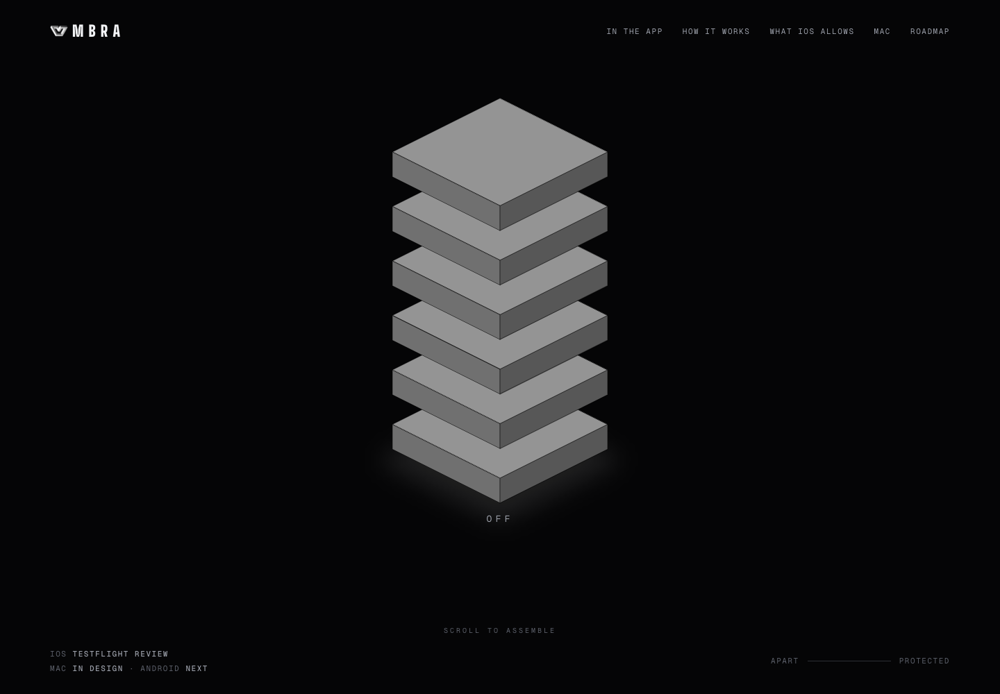
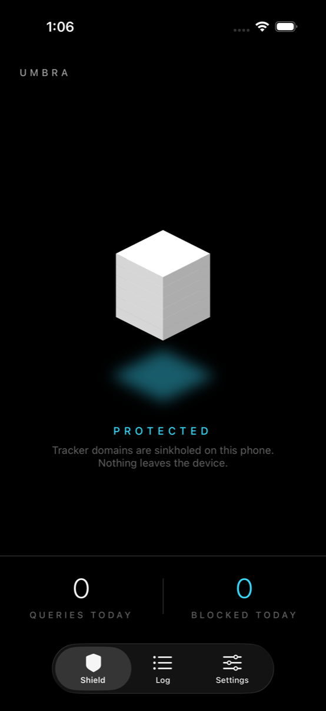
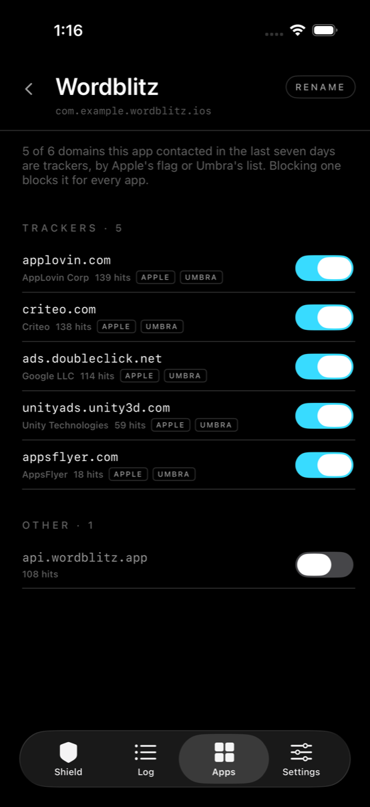

# Umbra site

Static site for Umbra, a DNS firewall for iPhone. `index.html` is the page, `privacy.html` the privacy policy, `blocklist.txt` the list the "Ask it yourself" box checks (a copy of `UmbraCore/Sources/UmbraCore/Resources/blocklist.txt`), `img/` the screenshots and logo. No build step.

Source of truth for the page lives in the Umbra project repository; this repository is what Vercel serves.

## Preview



<p>
  
  
</p>

The app images already live in `img/`. The landing-page screenshot is a browser capture of this repository on 2026-09-12.

## Run locally

```sh
python3 -m http.server 8000
```

Open `http://localhost:8000`, then use the page navigation to inspect the app screens and open the privacy policy. The website explains the app; running it does not start a DNS tunnel.
